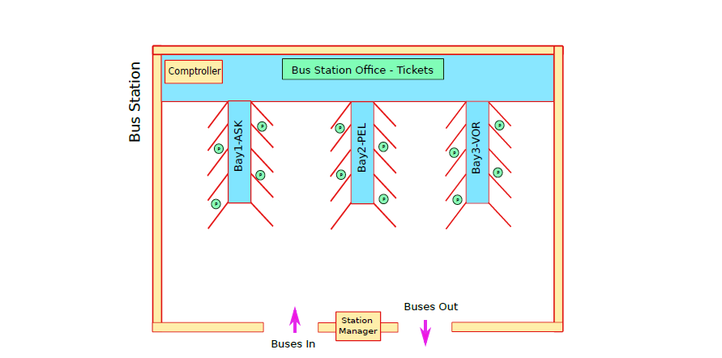

# Bus-Station-Assignment
A program that represents a Bus-Station using semaphores, fork and exec.


## Installation 
From terminal, inside src folder run ```make```

## Explanatory Diagram


## Run Parameters
Programs can be run as follows: 
for the bus program: ``` ./bus -t type -n incpassengers -c capacity -p parkperiod -m mantime -s shmid ```

* ```bus``` is the executable
* ```-t type``` is for the destination ASK, PEL or VOR
* ```-n incpassenegers``` is the number of passenger the vehicle is transfering  
*```-c capacity``` is the max nubmer of passenger that can get on the bus for the next trip 
*```p parkperiod``` is the max time the bus will stay parked 
*```-m mantime```is the time the bus has to maneuver for parking and leaving the station after getting the "ok" from the station-manager
*```-s shmid``` is the shared memory key

for the station-manager program: ```./station-manager -s shid```

* ```station-manager``` is the executable
* ```-s shmid``` is the shared memory key

for the comptroller program: ```./comptroller -d time -t stattimes -s shmid```

*```comptroller``` is the executable
*```-d time``` is the time after which the comptroller gives an update on currect state of the station
*```-t stattimes``` is the time after which the monitor calculates stats for the current structure
*```-s shmid``` is the shared memorry key

for the mystation program: ```./mystation -l configfile```

*```mystation``` is the executable
*```-l configfile``` is the file configfile with the information about the structure of the station and the max time a bus can reamain in the station

## Authors

Alex Karvounis - [al3xkarv](https://github.com/al3xkarv)

## License

This project is licensed under the GNU General Public License v3.0
